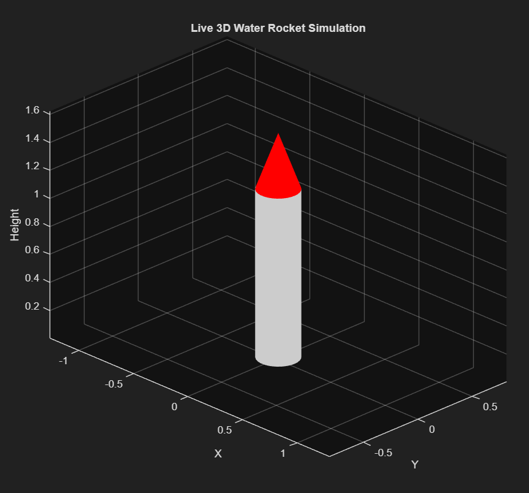
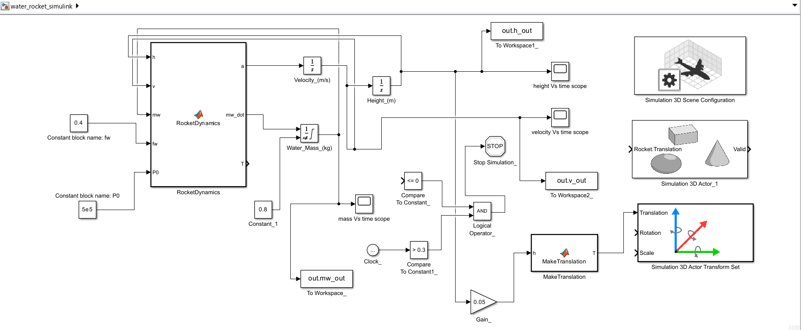
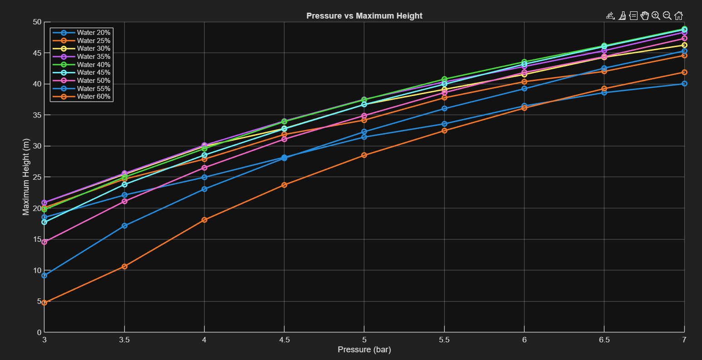
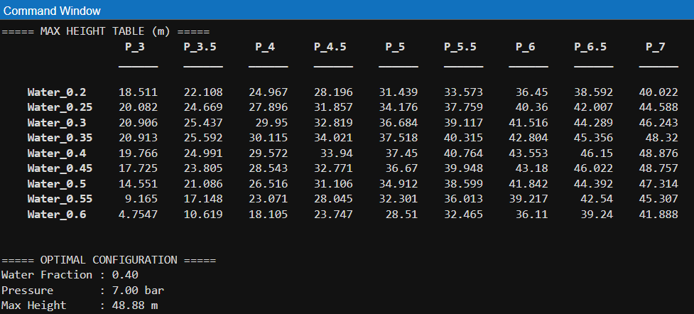

<div align="center">

# 🚀 Water Rocket Optimization using MATLAB & Simulink

### Automated Parametric Design, Simulation & Performance Analysis

<a href="https://github.com/Abhishek3m4/water-rocket-optimization-simulink">
  
</a>

<p>
  
  
  
  
  
  
</p>

<p>
  <b>Physics-based water rocket simulation + automated parameter sweep + Simulink validation</b>
</p>

</div>

---

## 📌 Overview

A MATLAB & Simulink-based **water rocket simulation and parametric optimization framework** developed during a rocketry internship.

The project evaluates different **water fractions and launch pressures**, simulates the rocket flight, and identifies the configuration producing the highest simulated altitude.

The internship brief specifically required a software simulation capable of analysing **trajectory, thrust and stability**. :chatgpt-content-reference{index="0"} :chatgpt-content-reference{index="1"}

---

## ⚡ Key Features

- 🚀 **Physics-Based Model** — Variable-mass rocket dynamics with thrust, drag and gravity.
- 🔁 **Parametric Sweep** — Water fraction: **20–60%** and pressure: **3–7 bar**.
- 📈 **Performance Analysis** — Height, velocity, thrust and burn-time histories.
- 🧮 **Automated Optimization** — Searches the parameter space for maximum simulated height.
- 🧩 **Simulink Model** — Block-based dynamic simulation of the rocket system.
- 🌐 **3D Visualization** — MATLAB-based animated rocket trajectory.

The modelling approach follows core rocketry concepts including thrust, gravity, drag, mass variation and aerodynamic stability. :chatgpt-content-reference{index="2"} :chatgpt-content-reference{index="3"}

---

## 🎬 Demo & Screenshots

### 3D MATLAB Simulation

<p align="center">
  
</p>

<p align="center">
  <b>Live 3D water rocket trajectory simulation in MATLAB</b>
</p>

---

### Simulink Simulation

<p align="center">
  
</p>

<p align="center">
  <b>Water rocket dynamic model implemented in Simulink</b>
</p>

<table>
<tr>
<td align="center">

<br><b>Simulink — Initial / Ground State</b>
</td>
<td align="center">

<br><b>Simulink — Maximum Height State</b>
</td>
</tr>
</table>

---

### Parametric Simulation Results

<table>
<tr>
<td align="center">

<br><b>20% Water</b>
</td>
<td align="center">

<br><b>40% Water</b>
</td>
</tr>
<tr>
<td align="center">

<br><b>60% Water</b>
</td>
<td align="center">

<br><b>Pressure vs Maximum Height</b>
</td>
</tr>
</table>

---

### Optimization Heatmaps

<table>
<tr>
<td align="center">

<br><b>Maximum Height Heatmap</b>
</td>
<td align="center">

<br><b>Burn Time Heatmap</b>
</td>
</tr>
</table>

<p align="center">
  
</p>

<p align="center">
  <b>Maximum-height parameter table generated from the automated sweep</b>
</p>

---

## 🔄 System Architecture / Workflow

```mermaid
flowchart LR
    A[Design Parameters] --> B[Water Fraction]
    A --> C[Initial Pressure]

    B --> D[Water Rocket Physics Model]
    C --> D

    D --> E[Variable Mass]
    D --> F[Pressure Decay]
    D --> G[Thrust]
    D --> H[Aerodynamic Drag]
    D --> I[Gravity]

    E --> J[Rocket Dynamics]
    F --> J
    G --> J
    H --> J
    I --> J

    J --> K[Trajectory]
    J --> L[Velocity]
    J --> M[Height]
    J --> N[Thrust History]

    A --> O[Parametric Sweep]
    O --> D
    O --> P[Performance Comparison]
    P --> Q[Optimal Configuration]

    J --> R[Simulink Model]
    R --> S[Dynamic Simulation]
    S --> T[Validation / Visualization]
